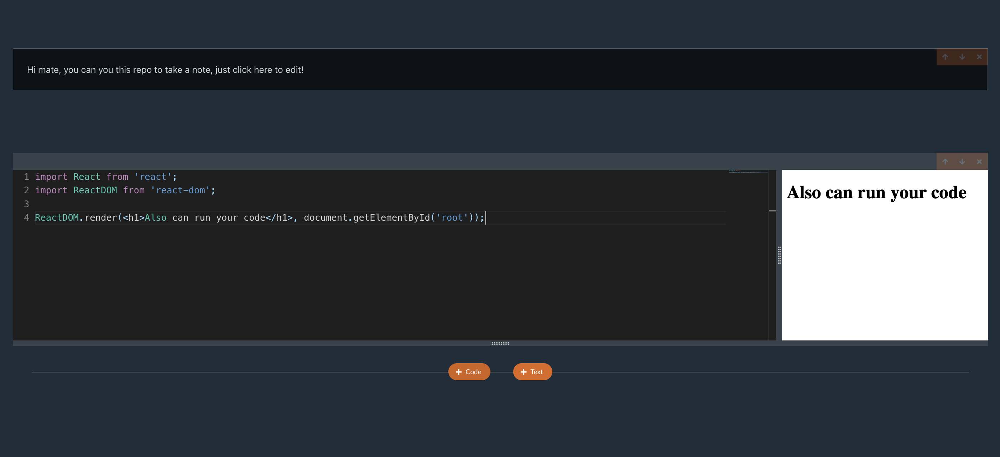

# Code Editor
A tool to launch an interactive development environment for writing and document code.

- [Requirements](#requirements)
- [System design](#system-design)
    - [1. High level design](#1-high-level-design)
    - [2. Detailed design](#2-detailed-design)
        - [a. CLI](#cli)
        - [a. Local API](#local-api)
        - [a. Client](#client)
- [Technicals](#technicals)
- [How to run](#how-to-run)

## Requirements
Building a simple tool that lets users start quickly with simple steps to check their code, also take notes on their code and share it with others.
- Not just a single piece of code, the tool could be created in multiple sections to let users test their code separately.
- The code editor must have enough built-in support, also for the text editor.
- Sections can share with each other, which helps users do need to type variables, functions again and again.
- Sections can be re-ordered, in case of users want to change their focus.
- User's code must be saved and can be shared.

## System design
### 1. High level design
- This project is built by Typescript. although it may be overkilled because of the size of the project. but it would help much if you want to widen the tool, i.e. add more functions, scale it...
- The project is divided into 3 repos, which contain separated logic. The most important focus of this idea is 3 repos can share code together, quickly reflect the changes when developing and store in 1 git repo to give a general view for developers. For all reasons,  Monorepo is used, powered by [Lerna](https://lerna.js.org/).
   1. CLI:
       - Need to know how to start up the Local API.
   2. Local API:
       - Need to serve up the React App.
       - Need to be able to save/load cells from a file.
   3. Client:
       - Need to make its production assets available to either the local api or the public api.
  
### 2. Detailed design
#### CLI
1. This is the tool that users can run from the command line, powered by [Commander](https://www.npmjs.com/package/commander) to utilize the user's commands.
2. This module contains code to start up local API.
3. Allow the users to persist their code/text and share it with others.
4. Allow the users to choose a specific file to open up or save cells into.

#### Local API
1. an [Express](https://www.npmjs.com/package/express) server plays a role as middleware between CLI and React App.
   1. Send back the assets for React App.
   2. Find a list of cells then store in a file (named provided to the CLI) and send those back.
   3. Take the list of cells and store them into a file.
2. **Issues**: 
   - When shipping React App to browser, we need to deal with 2 cases: after going production, React App is a build folder and when doing active development, we need to use develop version (build version takes a lot of time when has changes)

   => Solution: use [http-proxy-middleware](https://www.npmjs.com/package/http-proxy-middleware) to reflect the changes when doing active development and load static when going to production.

#### Client
1. Code bundle by [ESBuild](https://esbuild.github.io)
    1. Bundling locally
        - Remove an extra request to API server, make code executes faster.
        - We don't have to maintain an API server.
        - Less complexity - no moving code back and forth.
        - **Issue**: when bundling, ESBuild tries to find dependencies on a hard drive, but the code is built on the browser, so no file system and ESBuild will throw an error.
            - solution:
                - We need to build a plugin to intercept ESBuild and find the path should be for the dependencies.
                - Use [unpkg](https://unpkg.com) to overcome CORS issue when we get the package from npm: unpkg will redirect to the main file (index) of current version of dependencies.
                    - Issue with multiple and nested packages: Build a plugin to resolve file paths, then separate index files and other relative paths.
                    - Issue with too many requests call for 1 package: use [localForage](https://www.npmjs.com/package/localforage) to cache requests.
    2. Challenges when executing user code
        - Code will be provided to preview as a string, we have to execute it safely.
        - This code may have advanced js syntax in it that your browser cannot execute.
        - This code may have import statements from other js or css libraries. We have to deal with those import statements before executing the code.
    3. Issues with untrusted code
        - User provides code that might throw errors and cause a program to crash.
        - User provides code that might mutate the DOM, causing our program to crash.
        - User might accidentally run code provided by another malicious users.
       
    => This can be solved by running the user's code in IFrame with direct communication disabled.
2. Use an open-source editor to write code: [@monaco-editor/react](https://www.npmjs.com/package/@monaco-editor/react) gives an almost-perfect editing experience immediately
3. Using [Redux](https://redux.js.org/) to centralize all the states of cell and bundled code, every component can watch to this and do the update, prevent props drilling
4. Share code between code cells:
    To reuse code from previous code cells, we can access Redux and join bundled code from cells together, that would help the user do not type again a variable or a function, just calling them from previous cells is enough.
 
## Technicals
- Typescript
- React, Redux
- Express
- [Esbuild](https://www.npmjs.com/package/esbuild-wasm)
- [Commander](https://www.npmjs.com/package/commander)
- [Monaco editor](https://www.npmjs.com/package/@monaco-editor/react)
- [React md editor](https://www.npmjs.com/package/@uiw/react-md-editor)

## How to run
Run the command:
  > npx @joker7t/code-editor serve [filename] -p [port]
- default **filename**: notebook.js
- default **port**: 4005
      
